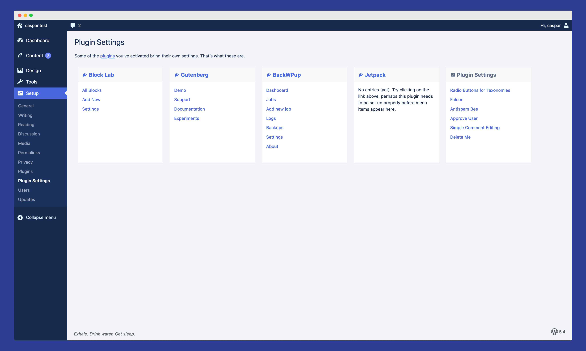

|                    |                                                         |
|--------------------|---------------------------------------------------------|
| **Author:**        | [@casparhubinger](https://github.com/casparhubinger/)   |
| **Donate link:**   | [https://paypal.me/caspar](https://paypal.me/caspar)    |
| Tags:              | `admin menu`, `wp-admin`, `minimalism`                  |
| Requires at least: | 5.3.2                                                   |
| Tested up to:      | 5.4.1                                                   |
| Requires PHP:      | 7.1.0                                                   |
| License:           | GNU General Public License v3                           |
| License URI:       | https://www.gnu.org/licenses/gpl-3.0.html               |

---

## 🥁 What is this?

<blockquote>
“Short term memory (or attention span) is limited to seven chunks of information.”
<cite>– <a href="https://www.instructionaldesign.org/theories/information-processing/">Information Processing Theory according to George A. Miller</a></cite></blockquote>

✅ This plugin minimises the WordPress admin menu to five (5) top-level items.

✅ It remixes submenus and adds some former top-level items to them.

✅ Finally, it bundles all third-party settings pages on a dedicated submenu page. No more plugins in the top level.

🚫 This is **not** an admin menu editor of any sorts.

🚫 There are **no options** for you to customise what goes where.

🎳 You’re free to fork this, clone it, hack it to pieces, make your own out of it.

### Minimised admin menu

- **Dasboard**
- **Content** – points to _Posts_
   - _Posts_ – formerly top-level page
   - _Categories_
   - _Tags_
   - _Comments_ – if enabled, formerly top-level page
   - _Pages_ – formerly top-level page
   - _Media_ – formerly top-level page
- **Design** – formerly _Apperance_ pointing to _Themes_, now points to _Customizer_
   - _Customizer_ – this is very you change your theme if you need to
   - _Theme Editor_
   - _Plugin Editor_ – formerly under _Plugins_
- **Tools** – formerly _All Tools_, now points to _Site Health_
   - _Site Health_
   - _Export Content_ – formerly _Export_
   - _Export Personal Data_
   - _Erase Personal Data_
- **Setup** - formerly _Settings_, still points to _General Settings_
   - _Writing_
   - _Reading_
   - _Discussion_
   - _Media_
   - _Permalinks_
   - _Privacy_
   - _Plugins_ – formerly top-level page
   - _Plugin Settings_ – custom page, bundles all third-party plugin settings
   - _Users_ – formerly top-level page
   - _Updates_ – formerly under _Dashboard_

## 💡 Installation

🚫 **DO NOT INSTALL THIS without running it on a testing site first!**

Clone this repository to your local machine, or [download the latest release](https://github.com/casparhubinger/glck-admin-menu/releases/latest).

You can install the .zip file like any other plugin via _wp-admin › Plugins › Add New_.

If you don’t know what a .zip file is, or how to upload one to WordPress, make sure you have a WordPress-savvy person nearby before you proceed, or you might end up breaking your website.

###  Will this be available via WordPress.org?

No plans in that direction, but you can use the [GitHub Updater plugin](https://github.com/afragen/github-updater/).

## 🌈 Translations

This plugin relies on core strings where possible, but it also does introduce a few strings of its own. These are translation-ready, a text domain gets loaded, and a .pot file is provided.

If translations are important to you, feel free to send a pull request with a .po and .mo file in your language. 

[Read more about translating WordPress plugins](https://developer.wordpress.org/apis/handbook/internationalization/localization/)

## 🛎 Support

None provided, but if you run into a glitch with another plugin, feel free to open an issue!

## 💸 You’re welcome!

If you include this plugin into your client projects, please do feel absolutely free to [send me money](https://paypal.me/caspar)!
